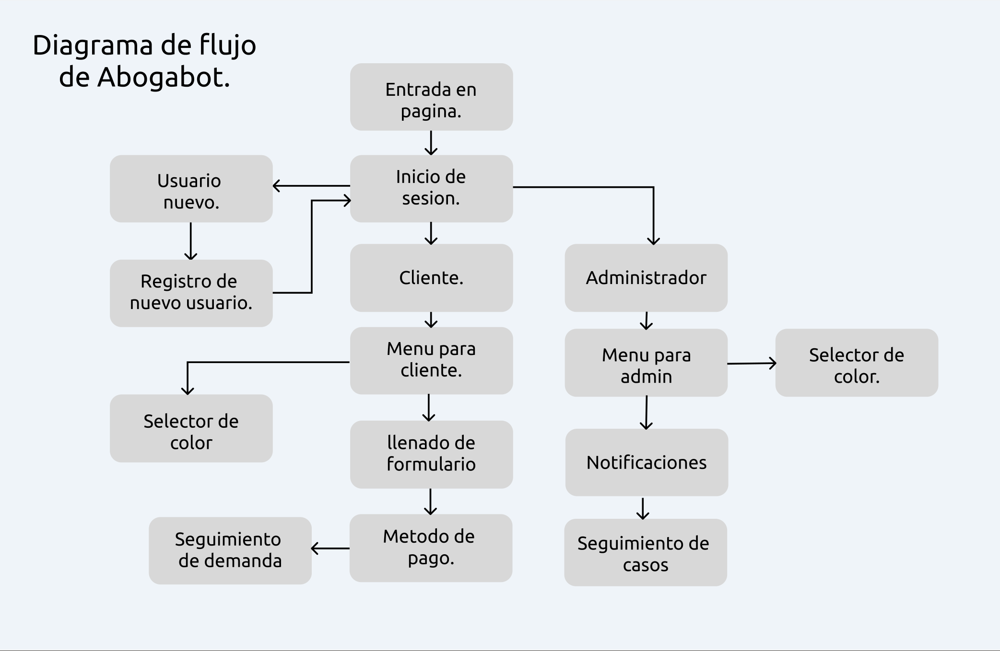
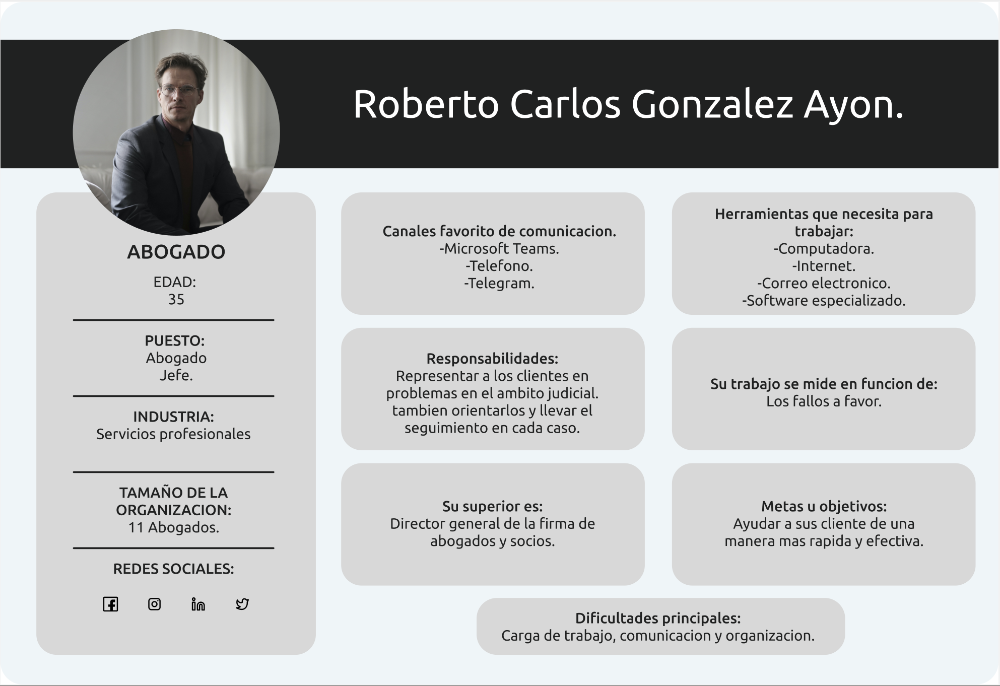
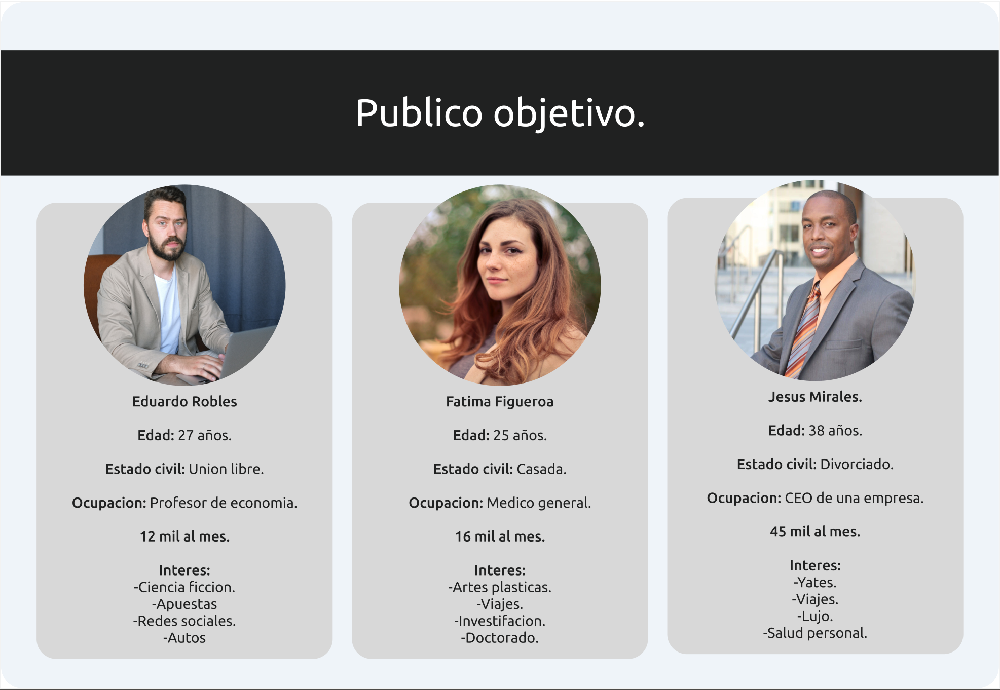

# ABOGABOT.

Utilice figma para crear los recursos graficos.

https://www.figma.com/file/HVHRiB2MxohJYGGruAs8CM/Buyer-persona?node-id=9%3A19

## **1. Toma de requerimentos.**
El cliente solicita una plataforma en la cual se automatizan los procesos de demandas de sus clientes, atravez de una pagina web que se pueda acceder mediante un mobil o una computadora.

***UX cliente***
- Crear cuenta cliente.
- Crear procesos mediante formularios.
- Metodo de pago.
- Seguimiento de sus demandas.
- Comentarios por parte del abogado.
- Notificaciones mediante correo para saber el avance de su proceso.
- Accesibilidad mediante mobil y pc.

***UX abogado***
- Crear cuenta de abogado.
- Recibir notificaciones.
- Recibir pagos y ver la cantidad de ingresos recibidos.
- Actualizar el proceso de la demanda y agregar comentarios en cada paso del proceso.

## **2. Buyer Persona.**
El cliente ideal del proyecto, que aqui se representa como el abogado jefe de la firma de abogados.

## **3. Publico Objetivo.**

los posibles usuarios del servicio.

## **4. UX.**

## **5. UI.**
